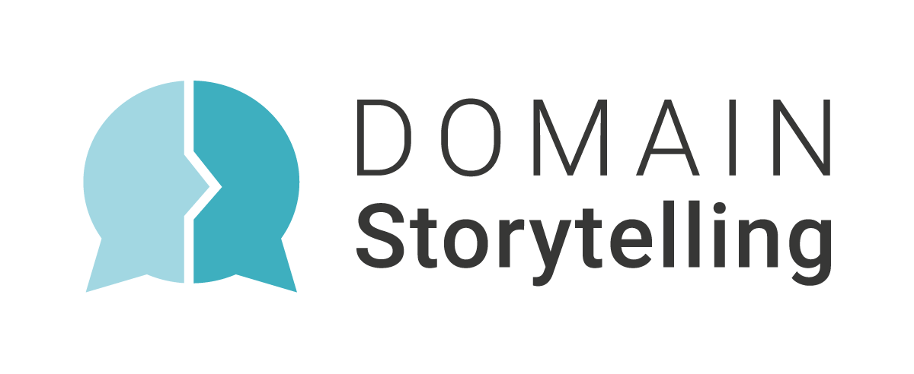
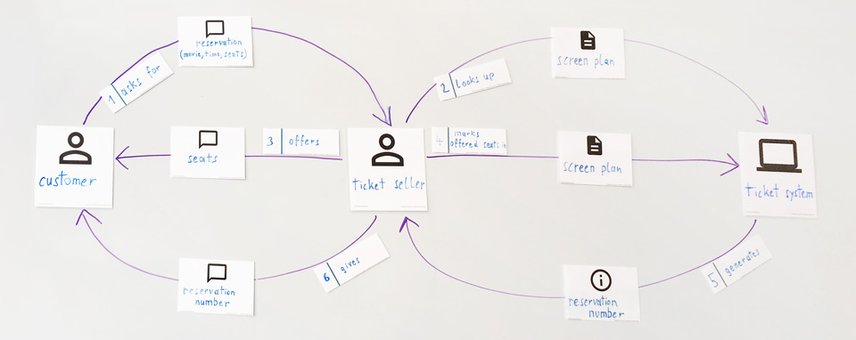
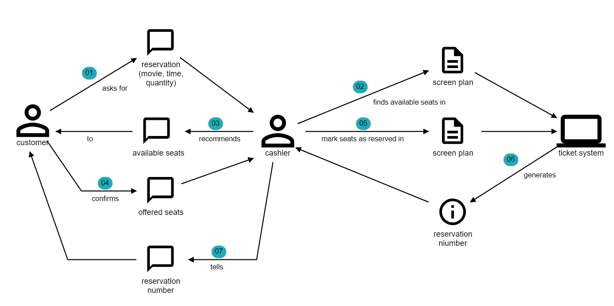
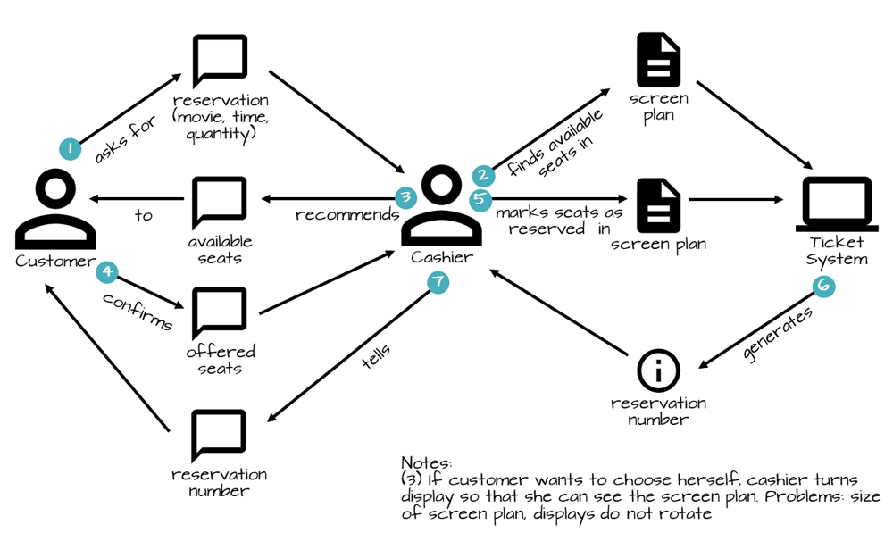
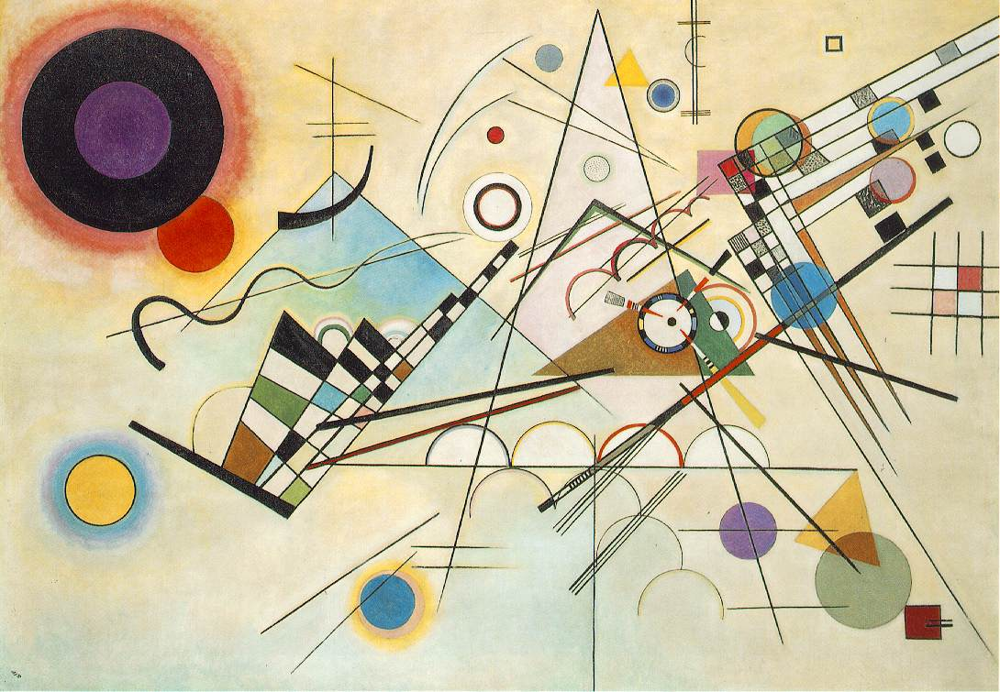

::: {.section .hero}
::: container
::: row
::: {.one-half .column}
### Learn domain language. Talk about requirements. **Tell domain stories.**
:::

::: {.one-half .column}

::: werbebanner
:::
:::
:::
:::
:::

::: header
{#menu-icon}

-   [Domain Storytelling\
    Explained](#dst-explained)
-   [Domain Storytelling &\
    Domain-Driven Design](#dst-ddd)
-   [Domain Storytelling &\
    Requirements](#dst-requirements)
:::

::: {#dst-explained .section .bg-white}
::: container
::: row
::: column
# {style="max-width: 400px;"}

The best way to learn a language is to listen to other people speak that
language. Try to repeat what you hear and mind their feedback.
Gradually, you will progress from individual words to phrases and to
complete sentences. The more you speak, the faster you will learn.

With **Domain Storytelling** you can employ the same principle when
learning a new domain language. Let domain experts tell their domain
stories. While listening, you record the domain stories using a
pictographic language. The domain experts can see immediately if you
understand their story correctly. After very few stories, you are able
to talk about the people, tasks, tools, work items, and events in that
domain.

\

**The best way to explain Domain Storytelling is to see it in action.\
Watch this live modeling session (hosted by the Virtual Domain-Driven
Design Meetup):**

::: video-container-wrapper
::: video-container
:::
:::

 

 

**To learn how to use Domain Storytelling yourself,\
[read this practical guide for
free](https://leanpub.com/domainstorytelling/read_sample) or get the
full book, available at Leanpub:**

::: teaser-box
[{.teaser-image-book}](https://leanpub.com/domainstorytelling)
:::

:::
:::
:::
:::

::: {.section .bg-white}
If you are in a hurry, read right on! This website sums up the practical
guide in a few paragraphs.
:::

::: {.section .learn_more}
::: container
::: row
::: {.four .columns}

{.icon}

We are building a community on **Slack**! Join our channel
#domain-storytelling at
[https://ddd-cqrs-es.slack.com](https://ddd-cqrs-es.slack.com/)

  To get an invitation, register yourself here:\
[Register now!](https://j.mp/ddd-es-cqrs)
:::

::: {.four .columns}

{.icon}

Stay up to date by following\
\
[\@hofstef](https://twitter.com/hofstef) and
[\@hschwentner](https://twitter.com/hschwentner)
:::

::: {.four .columns}

{.icon}

Find and share resources on GitHub:\
\
[Awesome Domain
Storytelling](https://github.com/hofstef/awesome-domain-storytelling)
:::
:::
:::
:::

::: {.section .bg-whDSTe .align-left}
::: container
::: row
## Your first Domain Story
:::

::: row
::: {.five .columns}
Imagine you are a software developer who was tasked to develop an app
for a cinema. The app should have an online reservation feature. Since
you have no clue where to start, you decide to interview a cashier. He
works at the ticket counter and takes reservations by phone and in
person. The picture shows a graphical recording of the cashier\'s Domain
Story. To read the story, just follow the numbers:

The customer asks the cashier for a reservation. The cashier looks up
the screen plan in the ticket system to find available seats. \... (you
get the idea)
:::

::: {.seven .columns}
::: row
::: column

:::
:::
:::
:::
:::
:::

::: {.section .bg-grey}
::: container
::: row
::: column
## The pictographic language

To record Domain Stories, we need a vocabulary and pictograms that
represent the vocabulary:
:::
:::

::: row
::: {.three .columns}
[]{.icon}

Domain Stories are told from an **actor**\'s perspective. Actors may be
a person, a group, or a software system. Hence, we use different
pictograms.
:::

::: {.three .columns}
[]{.icon}

Actors create, work with, and exchange **work objects** and
**information about work objects** such as documents and messages. The
pictograms represent the work object's medium.
:::

::: {.three .columns}
[]{.icon}

The actor\'s **activities** are depicted as arrows.
:::

::: {.three .columns}
[]{.icon}

Textual **annotations** are useful to document assumptions, variations
and exceptions.
:::
:::

::: row
::: column
\
To add a specific meaning to a pictogram, we name it with a term from
the domain language:\
An actor **cashier**, a work object **screen plan**, an activity
**confirms** etc.
:::
:::

------------------------------------------------------------------------

::: {.row .align-center}
::: column
In the examples on this website, we use about a dozen of Google\'s
Material icons that represent typical office work. Feel free to compile
your own set of pictograms that fits to your domain but keep in mind:

1\. Using many different icons will water down your pictographic
language.\
2. The icons add meaning to the story and make it "tangible".
:::
:::

------------------------------------------------------------------------
:::

::: container
::: {.row .align-left}
::: {.eight .columns}
### Now we can build a sentence\...

-   Every sentence starts with an **actor** who initiates an
    **activity**.
-   Next, you need a **work object** or a piece of information that the
    **actor** does something with. Choose a pictogram that represents
    the medium of that work object (e.g. a paper icon, an email icon or
    a bubble for verbal information).
-   Connect the **actor** and the **work object** with an **arrow**.
    Name the **arrow** according to the **activity** (e.g. creates,
    edits, sends).
-   If the **activity** involves another **actor**, draw another
    **arrow** from the **work object** to that **actor**. Often, a
    preposition (e.g. to, with) makes a good name for the **arrow**.

##### So the basic syntax is: subject - predicate - object. {#so-the-basic-syntax-is-subject---predicate---object. .m-1}

Keep in mind that anyone should be able to read the graphical Domain
Story out loud.
:::

::: {.four .columns}
### \...and tell a story

By numbering the arrows, we express the sequence of activities. Every
actor should appear only once in a Domain Story. However, if you use the
same work object in several sentences, you have to draw it several times
(maybe with different pictograms).
:::
:::
:::
:::

::: {.section .bg-white}
::: container
::: row
::: column
## Feeling lost?

Most business process modeling approaches show what can *possibly*
happen in a process:

{style="max-width: 600px;"}
:::
:::
:::

------------------------------------------------------------------------

::: container
::: row
::: {.eight .offset-by-two .columns}
While there is value in such \"algorithmic\" descriptions, for many
purposes you would be better suited with some examples of what
*actually* happens.

To paraphrase requirements engineering expert Peter Hruschka:\
*"Sometimes three good examples are more helpful to understand the
requirements than a bad abstraction."* [translated from]{.small-text}
^\[2\]^

**Domain Storytelling** helps you to find meaningful examples of what
actually happens in a business process. Maybe you noticed that the
visual language does not contain any symbols for cases, exceptions and
parallelism.\
Instead, the context of a Domain Story is defined with assumptions:\
*"Let's assume the customer calls. How do you take her reservation?"*

While you record the story, additional assumptions might be necessary:\
*"Assuming that there are enough seats available, what do you do
next?"*\
Important alternatives and error cases deserve their own Domain Story.\
Usually, very few Domain Stories are sufficient to understand a business
process. After recording Domain Stories for a few processes, you will
become fluent in the domain language.
:::
:::
:::
:::

::: {.section .quote}
::: container
::: row
## "You can learn more from a good example than from a bad abstraction."
:::
:::
:::

::: {.section .bg-white}
::: container
::: row
## Domain Storytelling Workshops
:::

::: row
::: {.five .offset-by-one .columns}
Domain Stories are developed in workshops. Participants include domain
experts (often from several departments), IT experts and a moderator.
The moderator communicates the purpose of the workshop. All participants
contribute to the story. The moderator keeps the participant's story
going by asking questions like:

**What happens next?\
Where do you get this information from?\
How do you determine what to do next?**
:::

::: {.five .columns}
The moderator helps to record the Domain Stories graphically. The story
needs to be visible for all participants (e.g. on a whiteboard or
projected on a screen). The participants see what gets recorded and give
feedback immediately.\
Once the story is finished, the moderator checks if all participants
agree upon the recorded Domain Story. Objections, important variations,
edge cases and so on are not dismissed but written down and may trigger
another Domain Story.
:::
:::

------------------------------------------------------------------------

::: row
::: {.ten .offset-by-one .columns}
#### Modeling is a thinking tool. The act of modeling is more important than the actual model.
:::
:::

------------------------------------------------------------------------

::: row
::: {.ten .offset-by-one .columns}
Do not think of Domain Stories as documentation. Use them to dive into
[Domain Driven Design](#dst-ddd), or [to uncover
requirements](#dst-requirements) for software development. Inviting the
right people to the workshops is important because the primary goal is
to learn and communicate. A picture of a Domain Story serves as an aid
to memory for those present at the workshop, but it is not a replacement
for participating.
:::
:::
:::
:::

::: {#dst-tools .section .bg-grey}
::: container
::: row
::: {.eight .offset-by-two .columns}
## Tools

Often a whiteboard and some sticky notes are all you need.

But since drawing the icons can be tedious, we have developed a
**whiteboard kit** to speed up the recording process.\
You can [download this
template](https://domainstorytelling.org/images/DST_Whiteboard-Kit.pdf)
and make your own kit.
:::
:::

::: row

:::

::: row
::: {.eight .offset-by-two .columns}
Often, you want to model several Domain Stories in one workshop. But
modeling space on whiteboards, flipcharts and walls is limited. Digital
modeling tools are an alternative. Use a projector to share the computer
screen so that everyone can see how the Domain Story evolves. You can
visualize Domain Stories with tools like PowerPoint, Visio, yEd or other
general purpose drawing tools. However, such tools have limitations. The
Domain Storytelling community came up with a modeling tool that is
specifically designed for Domain Stories: The Domain Story Modeler, made
by [WPS -- Workplace Solutions GmbH](https://www.wps.de/en). It is open
source and runs in your browser. [Try it
online!](https://www.wps.de/modeler) Or download [the latest release
from GitHub](https://github.com/WPS/domain-story-modeler/releases). Read
the documentation and give feedback [on
Github](https://github.com/WPS/domain-story-modeler).
:::
:::

::: row

:::
:::
:::

::: {.section .bg-white}
::: container
::: row
## Case Study: Cinema

Let\'s pick up the example we used earlier, but this time we add a
little bit more context: Imagine a chain of cinemas has asked us to
develop an app that allows their customers to make reservations and buy
electronic tickets. To familiarize ourselves with the domain, we set up
a Domain Storytelling workshop. We visit one of the cinemas and invite
an employee who works at the ticket counter, the local cinema manager,
and an administrator who manages the existing ticket system.
:::

------------------------------------------------------------------------

::: row
::: {.six .offset-by-three .columns}
First, we talk about the use cases that might be relevant for the app
and collect the information in a use case diagram that we draw on a flip
chart:

:::
:::

------------------------------------------------------------------------

::: row
::: {.ten .offset-by-one .columns}
Then, we want to learn how the use cases are handled today. We ask out
Domain Experts to pick an important use case and explain it to us in
detail. They decide to start with the ticket reservation use case
because it takes up a lot of the employee\'s time:

::: conversation
[Us:]{.conversation__speaker} ["What happens when someone wants to make
a reservation?"]{.conversation__message}
:::

::: conversation
[Employee:]{.conversation__speaker}"That depends. Does the customer call
or come to the counter in person?"
:::

::: conversation
[Us:]{.conversation__speaker}"So there are two ways of making a
reservation?"
:::

::: conversation
[Cinema Manager:]{.conversation__speaker}"Yes, but with the new app we
will introduce a third option."
:::

::: conversation
[Us:]{.conversation__speaker}"Let\'s stick to the present. Which way is
more important?"
:::

::: conversation
[Employee:]{.conversation__speaker} "We take more reservations by phone,
but taking a reservation at the ticket counter is more time consuming
for the cashier."
:::

\
We write \"Reservation at ticket counter\" on the whiteboard which we
use to record the Domain Story.

::: conversation
[Us:]{.conversation__speaker}"When you work at the ticket counter, you
are the cashier?"
:::

::: conversation
[Employee:]{.conversation__speaker}"That\'s right.\"
:::

::: conversation
[Us:]{.conversation__speaker}"OK. A customer has arrived at the ticket
counter. You are the cashier. What happens next?"
:::

\
Step by step, we record the Domain Story on the whiteboard:
:::
:::

::: row
::: {.eight .offset-by-two .columns}

:::
:::

------------------------------------------------------------------------

::: row
::: {.ten .offset-by-one .columns}
After step three, the employee hesitates.

::: conversation
[Employee:]{.conversation__speaker} "The customers who come to the
ticket counter in person are often quite difficult. They know the cinema
very well and prefer certain seats or won\'t buy tickets for certain
theaters."
:::

::: conversation
[Us:]{.conversation__speaker} "Let\'s assume the best case scenario:
Your customer is happy with the seats that you offer. We will deal with
more challenging customers later."
:::

::: conversation
[Employee:]{.conversation__speaker} "When the customer accepts the
seats, I mark the offered seats as reserved in the screen plan."
:::

\
The employee continues with his story until the reservation number is
generated.
:::
:::

::: row
::: {.eight .offset-by-two .columns}

:::
:::

::: row
::: {.ten .offset-by-one .columns}
::: conversation
[Administrator:]{.conversation__speaker} "In step 5, the system saves
the reservation to the database. What happens if the seats are not
available any more by the time you click the reservation button?"
:::

::: conversation
[Employee:]{.conversation__speaker} "I don\'t know. I have been working
here for three years, but that never happened to me."
:::

::: conversation
[Manager:]{.conversation__speaker} "I am sure that we do not sell the
same seat twice for the same show. There have never been any
complaints."
:::

::: conversation
[Us:]{.conversation__speaker} "Still, it would be interesting to know
how the ticket system reacts."
:::

::: conversation
[Administrator:]{.conversation__speaker} "I will check the documentation
when I am back in the office."
:::

::: conversation
[Us:]{.conversation__speaker} "Back to your \'challenging\' customers.
What would be different if such a customer wants to make a reservation?"
:::

::: conversation
[Employee:]{.conversation__speaker} "In step 1, the customer would
request certain seats."
:::

::: conversation
[Us:]{.conversation__speaker} "If these seats are available, the story
does not change, does it?"
:::

::: conversation
[Employee:]{.conversation__speaker} "You are right. But if they are not
available, I give them other options."
:::

::: conversation
[Us:]{.conversation__speaker} "How do you do that?"
:::

::: conversation
[Employee:]{.conversation__speaker} "The easiest way is to turn my
display to the customer so that he can see the available seats in the
screen plan."
:::

::: conversation
[Administrator:]{.conversation__speaker} "But the screen plan is tiny!
And the display stand doesn\'t rotate! Do you really work like that?"
:::

::: conversation
[Employee:]{.conversation__speaker} "Sadly, yes."
:::

::: conversation
[Us:]{.conversation__speaker} "Let\'s make an annotation to our Domain
Story.
:::

\
We write: \"3) If customer wants to choose herself, cashier turns
display to customer so she can see the screen plan. Problems: size of
screen plan, displays do not rotate."

::: conversation
[Us:]{.conversation__speaker} "Is that okay?"
:::

\
Employee, manager and administrator all nod their heads.

::: conversation
[Us:]{.conversation__speaker} "Is there anything else we need to know
about making reservations at the ticket counter?"
:::

::: conversation
[Employee:]{.conversation__speaker} "I think we covered everything."
:::

\
Manager and administrator nod their heads in agreement. This is our
Domain Story:
:::
:::

::: row
::: {.eight .offset-by-two .columns}

:::
:::

::: row
::: {.ten .offset-by-one .columns}
We revisit the use case diagram. We have just learned that the ticket
system is an actor in the reservation process and that reservations can
be made at the ticket counter and by phone. Hence, we update the use
case diagram accordingly.
:::
:::

::: row
::: {.six .offset-by-three .columns}

:::
:::

::: row
::: {.ten .offset-by-one .columns}
We captured the relevant variations of the ticket reservation use case
in one Domain Story. There is no need for an additional ticket
reservation Domain Story. Hence, we continue with the next use case.

It will take more than one workshop to gather enough knowledge about the
domain. We could run another workshop with someone from marketing and
someone who is in charge of the screen plans. Or maybe some of the
cinemas have a special focus (e.g. festivals, art movies) and work
differently. As a rule of thumb, 3-5 workshops should produce enough
knowledge so that we can communicate with the domain experts about their
needs, requirements and problems.
:::
:::
:::
:::

::: {.section .bg-grey}
::: container
::: row
## A short history of Domain Storytelling
:::

::: row
::: {.one .offset-by-two .column}
#### 1996
:::

::: {.seven .columns .align-left}
At Hamburg University, [cooperation
pictures](https://swa.informatik.uni-hamburg.de/files/veroeffentlichungen/finalIris96.pdf)
are created as a requirements engineering method. Cooperating actors and
their work objects are visualized with pictograms.
:::
:::

::: row
::: {.one .offset-by-two .column}
#### 2003
:::

::: {.seven .columns .align-left}
A University spin-off (now [WPS -- Workplace
Solutions](https://www.wps.de/) Ltd.) adapts cooperation pictures to
visualize workflows. The method is used in dozens of projects under the
name exemplary business process modeling.
:::
:::

::: row
::: {.one .offset-by-two .column}
#### 2011
:::

::: {.seven .columns .align-left}
Based on the [adoxx.org](http://www.adoxx.org/) modeling toolkit, WPS
releases a free tool for enterprise modeling. Cooperation pictures are
augmented with a glossary, use cases, org-charts, process landscapes,
and IT landscapes. The [current
version](http://austria.omilab.org/psm/content/egpm) is from 2016
(German only).
:::
:::

::: row
::: {.one .offset-by-two .column}
#### 2016
:::

::: {.seven .columns .align-left}
DDD enthusiasts at WPS boil down the approach and add a catchy name to
it: **Domain Storytelling**.
:::
:::
:::
:::

::: {#dst-ddd .section .bg-white .align-left}
::: container
::: row
## Domain-Driven Design with Domain Storytelling
:::

::: row
::: {.seven .columns}
Since Eric Evans ^\[1\]^ coined the term **Domain-Driven Design (DDD)**,
an ever growing DDD community builds software that reflects its domain.
If you are new to DDD, we recommend [this concise
introduction](https://leanpub.com/theanatomyofdomain-drivendesign) by
Scott Millett.

##### "Domain-Driven Design is a language and domain-centric approach to software design for complex problem domains." [-- Scott Millet ^\[3\]^]{.medium-text}

DDD consists of patterns, principles and practices. For some of them
Domain Storytelling is of particular use.
:::

::: {.five .columns}

:::
:::

------------------------------------------------------------------------

::: {.row .align-center}
### Get familiar with your domain

::: {.ten .offset-by-one .columns}
Domain Storytelling is a **knowledge crunching** technique. The people
who participate in a Domain Storytelling workshop will get new insights
into the domain. The resulting Domain Stories express their shared
understanding. Other ways to build domain knowledge include scenarios
^\[4\]^ and scenario exploring^\[1\]^. Domain Stories help you to come
up with scenarios and to visualize them.

When you approach a domain, we recommend to start broad. Invite people
from several departments to create coarse-grained Domain Stories. Do not
limit yourself by existing organizational boundaries (or perceived
bounded contexts, if you already familiar with DDD) and record Domain
Stories that bridge departments. See [Domain Storytelling
Explained](#dst-explained) for guidelines and examples of Domain Stories
that provide an overview of a domain.
:::
:::

::: {.row .align-center}
### Strategic Design

::: {.ten .offset-by-one .columns}
If you want to develop software, you need more than just an
understanding of a domain. You need rich domain models that express deep
knowledge. But the more details you add, the more ambiguous and complex
your models will get. In DDD, we make our models manageable by
partitioning the domain into bounded contexts. Every bounded context has
its own set of models and ultimately its own, unambiguous ubiquitous
language.

Finding good context boundaries is hard. Domain Stories can help because
they show how people work together within and across subdomains -- and
how unsuitable boundaries prevent people from working together.
:::
:::

::: {.row .align-center}
::: {.six .offset-by-three .columns}
### Putting it all together

Watch this talk to see how Domain Storytelling helps you to practice
DDD:
:::
:::

------------------------------------------------------------------------
:::
:::

::: {#dst-requirements .section .bg-grey}
::: container
::: row
## Domain Storytelling and Requirements

::: {.ten .offset-by-one .columns}
The people involved in requirements elicitation have to learn and to
communicate continuously. If you have read [Domain Storytelling
Explained](#dst-explained), you saw how Domain Storytelling helps to
learn domain language and to reach a shared understanding. If you are a
product owner, domain expert, business analyst, or developer who has to
deal with requirements, you can use Domain Storytelling\...

1\. to identify weaknesses in IT-support and cooperation.\
2. to visualize how the domain will change because of the software being
developed.\
3. as a starting point for writing down requirements.

Domain Stories help to initially fill a product backlog with epics and
user stories. The user stories can usually be derived directly from the
domain stories. For example, earlierer we recorded a Domain Story about
making ticket reservations. We have learned that when a customer
reserves tickets on site, the cashier opens the screen plan for the show
and offers seats. From that, we can derive a high-level user story
(without acceptance criteria): "As a cashier, I want to determine the
free seats for a show so that I can offer these seats to my customers."
:::
:::
:::
:::

::: {.section .bg-white .align-left}
::: {.offset-by-one .columns}
References:\
\[1\] Eric Evans: Domain-Driven Design: Tackling Complexity in the Heart
of Software, Addison Wesley, 2003 -- \[2\] Peter Hruschka: Business
Analysis und Requirements Engineering, Hanser, 2014 -- \[3\] Scott
Millett: The Anatomy of Domain-Driven Design, leanpub.com, 2017 -- \[4\]
Vaughn Vernon: Domain-Driven Design Distilled, Addison Wesley, 2016
:::
:::

::: {.section .footer}
::: container
[{style="border-width:0; width: 5em;"}](http://creativecommons.org/licenses/by/4.0/)\
[Domain Storytelling Website]{xmlns:dct="http://purl.org/dc/terms/"
property="dct:title"} by [Stefan Hofer](https://twitter.com/hofstef) is
licensed under a [Creative Commons Attribution 4.0 International
License](http://creativecommons.org/licenses/by/4.0/)
:::

::: container
Imprint: [WPS -- Workplace Solutions
GmbH](https://www.wps.de/impressum/) \| [Data Protection / Privacy
Policy](https://www.wps.de/en/privacy/)
:::
:::
