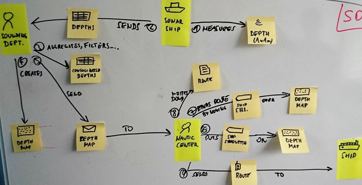
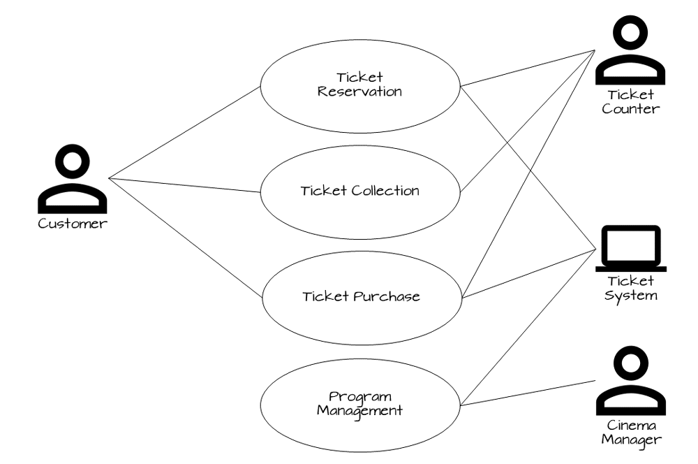
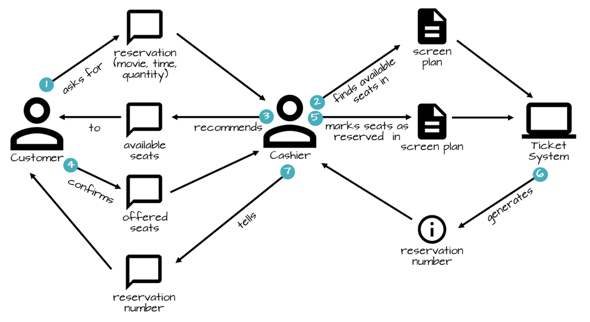
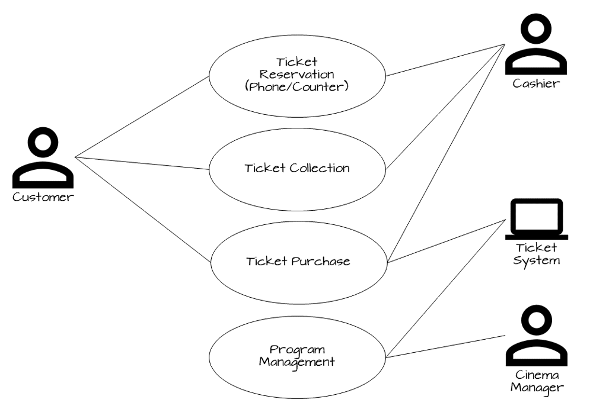

# Learn domain language. Talk about requirements. **Tell domain stories.**

-   [Domain Storytelling  
    Explained](#dst-explained)
-   [Domain Storytelling &  
    Domain-Driven Design](#dst-ddd)
-   [Domain Storytelling &  
    Requirements](#dst-requirements)

# 

The best way to learn a language is to listen to other people speak that language. Try to repeat what you hear and mind their feedback. Gradually, you will progress from individual words to phrases and to complete sentences. The more you speak, the faster you will learn.

With **Domain Storytelling** you can employ the same principle when learning a new domain language. Let domain experts tell their domain stories. While listening, you record the domain stories using a pictographic language. The domain experts can see immediately if you understand their story correctly. After very few stories, you are able to talk about the people, tasks, tools, work items, and events in that domain.

  

**The best way to explain Domain Storytelling is to see it in action.  
Watch this live modeling session (hosted by the Virtual Domain-Driven Design Meetup):**

 

 

**To learn how to use Domain Storytelling yourself,  
[read this practical guide for free](https://leanpub.com/domainstorytelling/read_sample) or get the full book, available at Leanpub:**

If you are in a hurry, read right on! This website sums up the practical guide in a few paragraphs.

We are building a community on **Slack**! Join our channel #domain-storytelling at [https://ddd-cqrs-es.slack.com](https://ddd-cqrs-es.slack.com/)

  To get an invitation, register yourself here:  
[Register now!](https://j.mp/ddd-es-cqrs)

Stay up to date by following  
  
[@hofstef](https://twitter.com/hofstef) and [@hschwentner](https://twitter.com/hschwentner)

Find and share resources on GitHub:  
  
[Awesome Domain Storytelling](https://github.com/hofstef/awesome-domain-storytelling)

## Your first Domain Story

Imagine you are a software developer who was tasked to develop an app for a cinema. The app should have an online reservation feature. Since you have no clue where to start, you decide to interview a cashier. He works at the ticket counter and takes reservations by phone and in person. The picture shows a graphical recording of the cashier's Domain Story. To read the story, just follow the numbers:

The customer asks the cashier for a reservation. The cashier looks up the screen plan in the ticket system to find available seats. ... (you get the idea)

## The pictographic language

To record Domain Stories, we need a vocabulary and pictograms that represent the vocabulary:

Domain Stories are told from an **actor**'s perspective. Actors may be a person, a group, or a software system. Hence, we use different pictograms.

Actors create, work with, and exchange **work objects** and **information about work objects** such as documents and messages. The pictograms represent the work object’s medium.

The actor's **activities** are depicted as arrows.

Textual **annotations** are useful to document assumptions, variations and exceptions.

  
To add a specific meaning to a pictogram, we name it with a term from the domain language:  
An actor **cashier**, a work object **screen plan**, an activity **confirms** etc.

------------------------------------------------------------------------

In the examples on this website, we use about a dozen of Google's Material icons that represent typical office work. Feel free to compile your own set of pictograms that fits to your domain but keep in mind:

1\. Using many different icons will water down your pictographic language.  
2. The icons add meaning to the story and make it “tangible”.

------------------------------------------------------------------------

### Now we can build a sentence...

-   Every sentence starts with an **actor** who initiates an **activity**.
-   Next, you need a **work object** or a piece of information that the **actor** does something with. Choose a pictogram that represents the medium of that work object (e.g. a paper icon, an email icon or a bubble for verbal information).
-   Connect the **actor** and the **work object** with an **arrow**. Name the **arrow** according to the **activity** (e.g. creates, edits, sends).
-   If the **activity** involves another **actor**, draw another **arrow** from the **work object** to that **actor**. Often, a preposition (e.g. to, with) makes a good name for the **arrow**.

##### So the basic syntax is: subject - predicate - object.

Keep in mind that anyone should be able to read the graphical Domain Story out loud.

### ...and tell a story

By numbering the arrows, we express the sequence of activities. Every actor should appear only once in a Domain Story. However, if you use the same work object in several sentences, you have to draw it several times (maybe with different pictograms).

## Feeling lost?

Most business process modeling approaches show what can *possibly* happen in a process:

------------------------------------------------------------------------

While there is value in such "algorithmic" descriptions, for many purposes you would be better suited with some examples of what *actually* happens.

To paraphrase requirements engineering expert Peter Hruschka:  
*“Sometimes three good examples are more helpful to understand the requirements than a bad abstraction.”* translated from \[2\]

**Domain Storytelling** helps you to find meaningful examples of what actually happens in a business process. Maybe you noticed that the visual language does not contain any symbols for cases, exceptions and parallelism.  
Instead, the context of a Domain Story is defined with assumptions:  
*“Let’s assume the customer calls. How do you take her reservation?”*

While you record the story, additional assumptions might be necessary:  
*“Assuming that there are enough seats available, what do you do next?”*  
Important alternatives and error cases deserve their own Domain Story.  
Usually, very few Domain Stories are sufficient to understand a business process. After recording Domain Stories for a few processes, you will become fluent in the domain language.

## “You can learn more from a good example than from a bad abstraction.”

## Domain Storytelling Workshops

Domain Stories are developed in workshops. Participants include domain experts (often from several departments), IT experts and a moderator. The moderator communicates the purpose of the workshop. All participants contribute to the story. The moderator keeps the participant’s story going by asking questions like:

**What happens next?  
Where do you get this information from?  
How do you determine what to do next?**

The moderator helps to record the Domain Stories graphically. The story needs to be visible for all participants (e.g. on a whiteboard or projected on a screen). The participants see what gets recorded and give feedback immediately.  
Once the story is finished, the moderator checks if all participants agree upon the recorded Domain Story. Objections, important variations, edge cases and so on are not dismissed but written down and may trigger another Domain Story.

------------------------------------------------------------------------

#### Modeling is a thinking tool. The act of modeling is more important than the actual model.

------------------------------------------------------------------------

Do not think of Domain Stories as documentation. Use them to dive into [Domain Driven Design](#dst-ddd), or [to uncover requirements](#dst-requirements) for software development. Inviting the right people to the workshops is important because the primary goal is to learn and communicate. A picture of a Domain Story serves as an aid to memory for those present at the workshop, but it is not a replacement for participating.

## Tools

Often a whiteboard and some sticky notes are all you need.

But since drawing the icons can be tedious, we have developed a **whiteboard kit** to speed up the recording process.  
You can [download this template](https://domainstorytelling.org/images/DST_Whiteboard-Kit.pdf) and make your own kit.

Often, you want to model several Domain Stories in one workshop. But modeling space on whiteboards, flipcharts and walls is limited. Digital modeling tools are an alternative. Use a projector to share the computer screen so that everyone can see how the Domain Story evolves. You can visualize Domain Stories with tools like PowerPoint, Visio, yEd or other general purpose drawing tools. However, such tools have limitations. The Domain Storytelling community came up with a modeling tool that is specifically designed for Domain Stories: The Domain Story Modeler, made by [WPS – Workplace Solutions GmbH](https://www.wps.de/en). It is open source and runs in your browser. [Try it online!](https://www.wps.de/modeler) Or download [the latest release from GitHub](https://github.com/WPS/domain-story-modeler/releases). Read the documentation and give feedback [on Github](https://github.com/WPS/domain-story-modeler).

## Case Study: Cinema

Let's pick up the example we used earlier, but this time we add a little bit more context: Imagine a chain of cinemas has asked us to develop an app that allows their customers to make reservations and buy electronic tickets. To familiarize ourselves with the domain, we set up a Domain Storytelling workshop. We visit one of the cinemas and invite an employee who works at the ticket counter, the local cinema manager, and an administrator who manages the existing ticket system.

------------------------------------------------------------------------

First, we talk about the use cases that might be relevant for the app and collect the information in a use case diagram that we draw on a flip chart:

------------------------------------------------------------------------

Then, we want to learn how the use cases are handled today. We ask out Domain Experts to pick an important use case and explain it to us in detail. They decide to start with the ticket reservation use case because it takes up a lot of the employee's time:

Us: “What happens when someone wants to make a reservation?”

Employee:“That depends. Does the customer call or come to the counter in person?”

Us:“So there are two ways of making a reservation?”

Cinema Manager:“Yes, but with the new app we will introduce a third option.”

Us:“Let's stick to the present. Which way is more important?”

Employee: “We take more reservations by phone, but taking a reservation at the ticket counter is more time consuming for the cashier.”

  
We write "Reservation at ticket counter" on the whiteboard which we use to record the Domain Story.

Us:“When you work at the ticket counter, you are the cashier?”

Employee:“That's right."

Us:“OK. A customer has arrived at the ticket counter. You are the cashier. What happens next?”

  
Step by step, we record the Domain Story on the whiteboard:

------------------------------------------------------------------------

After step three, the employee hesitates.

Employee: “The customers who come to the ticket counter in person are often quite difficult. They know the cinema very well and prefer certain seats or won't buy tickets for certain theaters.”

Us: “Let's assume the best case scenario: Your customer is happy with the seats that you offer. We will deal with more challenging customers later.”

Employee: “When the customer accepts the seats, I mark the offered seats as reserved in the screen plan.”

  
The employee continues with his story until the reservation number is generated.

Administrator: “In step 5, the system saves the reservation to the database. What happens if the seats are not available any more by the time you click the reservation button?”

Employee: “I don't know. I have been working here for three years, but that never happened to me.”

Manager: “I am sure that we do not sell the same seat twice for the same show. There have never been any complaints.”

Us: “Still, it would be interesting to know how the ticket system reacts.”

Administrator: “I will check the documentation when I am back in the office.”

Us: “Back to your 'challenging' customers. What would be different if such a customer wants to make a reservation?”

Employee: “In step 1, the customer would request certain seats.”

Us: “If these seats are available, the story does not change, does it?”

Employee: “You are right. But if they are not available, I give them other options.”

Us: “How do you do that?”

Employee: “The easiest way is to turn my display to the customer so that he can see the available seats in the screen plan.”

Administrator: “But the screen plan is tiny! And the display stand doesn't rotate! Do you really work like that?”

Employee: “Sadly, yes.”

Us: “Let's make an annotation to our Domain Story.

  
We write: "3) If customer wants to choose herself, cashier turns display to customer so she can see the screen plan. Problems: size of screen plan, displays do not rotate.”

Us: “Is that okay?”

  
Employee, manager and administrator all nod their heads.

Us: “Is there anything else we need to know about making reservations at the ticket counter?”

Employee: “I think we covered everything.”

  
Manager and administrator nod their heads in agreement. This is our Domain Story:

We revisit the use case diagram. We have just learned that the ticket system is an actor in the reservation process and that reservations can be made at the ticket counter and by phone. Hence, we update the use case diagram accordingly.

We captured the relevant variations of the ticket reservation use case in one Domain Story. There is no need for an additional ticket reservation Domain Story. Hence, we continue with the next use case.

It will take more than one workshop to gather enough knowledge about the domain. We could run another workshop with someone from marketing and someone who is in charge of the screen plans. Or maybe some of the cinemas have a special focus (e.g. festivals, art movies) and work differently. As a rule of thumb, 3-5 workshops should produce enough knowledge so that we can communicate with the domain experts about their needs, requirements and problems.

## A short history of Domain Storytelling

#### 1996

At Hamburg University, [cooperation pictures](https://swa.informatik.uni-hamburg.de/files/veroeffentlichungen/finalIris96.pdf) are created as a requirements engineering method. Cooperating actors and their work objects are visualized with pictograms.

#### 2003

A University spin-off (now [WPS – Workplace Solutions](https://www.wps.de/) Ltd.) adapts cooperation pictures to visualize workflows. The method is used in dozens of projects under the name exemplary business process modeling.

#### 2011

Based on the [adoxx.org](http://www.adoxx.org/) modeling toolkit, WPS releases a free tool for enterprise modeling. Cooperation pictures are augmented with a glossary, use cases, org-charts, process landscapes, and IT landscapes. The [current version](http://austria.omilab.org/psm/content/egpm) is from 2016 (German only).

#### 2016

DDD enthusiasts at WPS boil down the approach and add a catchy name to it: **Domain Storytelling**.

## Domain-Driven Design with Domain Storytelling

Since Eric Evans \[1\] coined the term **Domain-Driven Design (DDD)**, an ever growing DDD community builds software that reflects its domain. If you are new to DDD, we recommend [this concise introduction](https://leanpub.com/theanatomyofdomain-drivendesign) by Scott Millett.

##### “Domain-Driven Design is a language and domain-centric approach to software design for complex problem domains.” – Scott Millet \[3\]

DDD consists of patterns, principles and practices. For some of them Domain Storytelling is of particular use.

------------------------------------------------------------------------

### Get familiar with your domain

Domain Storytelling is a **knowledge crunching** technique. The people who participate in a Domain Storytelling workshop will get new insights into the domain. The resulting Domain Stories express their shared understanding. Other ways to build domain knowledge include scenarios \[4\] and scenario exploring\[1\]. Domain Stories help you to come up with scenarios and to visualize them.

When you approach a domain, we recommend to start broad. Invite people from several departments to create coarse-grained Domain Stories. Do not limit yourself by existing organizational boundaries (or perceived bounded contexts, if you already familiar with DDD) and record Domain Stories that bridge departments. See [Domain Storytelling Explained](#dst-explained) for guidelines and examples of Domain Stories that provide an overview of a domain.

### Strategic Design

If you want to develop software, you need more than just an understanding of a domain. You need rich domain models that express deep knowledge. But the more details you add, the more ambiguous and complex your models will get. In DDD, we make our models manageable by partitioning the domain into bounded contexts. Every bounded context has its own set of models and ultimately its own, unambiguous ubiquitous language.

Finding good context boundaries is hard. Domain Stories can help because they show how people work together within and across subdomains – and how unsuitable boundaries prevent people from working together.

### Putting it all together

Watch this talk to see how Domain Storytelling helps you to practice DDD:

------------------------------------------------------------------------

## Domain Storytelling and Requirements

The people involved in requirements elicitation have to learn and to communicate continuously. If you have read [Domain Storytelling Explained](#dst-explained), you saw how Domain Storytelling helps to learn domain language and to reach a shared understanding. If you are a product owner, domain expert, business analyst, or developer who has to deal with requirements, you can use Domain Storytelling...

1\. to identify weaknesses in IT-support and cooperation.  
2. to visualize how the domain will change because of the software being developed.  
3. as a starting point for writing down requirements.

Domain Stories help to initially fill a product backlog with epics and user stories. The user stories can usually be derived directly from the domain stories. For example, earlier we recorded a Domain Story about making ticket reservations. We have learned that when a customer reserves tickets on site, the cashier opens the screen plan for the show and offers seats. From that, we can derive a high-level user story (without acceptance criteria): “As a cashier, I want to determine the free seats for a show so that I can offer these seats to my customers.”

References:  
\[1\] Eric Evans: Domain-Driven Design: Tackling Complexity in the Heart of Software, Addison Wesley, 2003 – \[2\] Peter Hruschka: Business Analysis und Requirements Engineering, Hanser, 2014 – \[3\] Scott Millett: The Anatomy of Domain-Driven Design, leanpub.com, 2017 – \[4\] Vaughn Vernon: Domain-Driven Design Distilled, Addison Wesley, 2016

  
Domain Storytelling Website by [Stefan Hofer](https://twitter.com/hofstef) is licensed under a [Creative Commons Attribution 4.0 International License](http://creativecommons.org/licenses/by/4.0/)

Imprint: [WPS – Workplace Solutions GmbH](https://www.wps.de/impressum/) \| [Data Protection / Privacy Policy](https://www.wps.de/en/privacy/)

